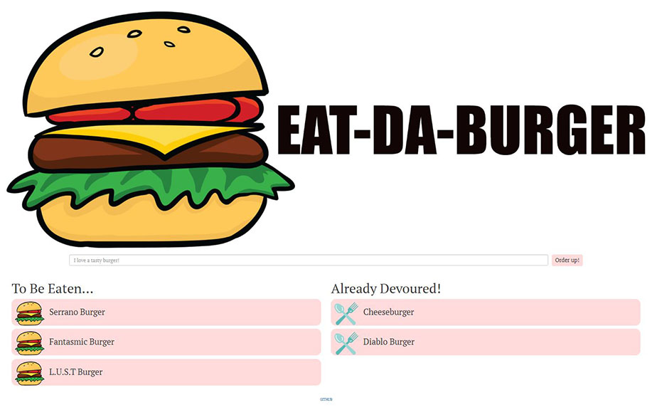

# Eat-Da-Burger

Eat-Da-Burger is a restaurant application that lets users input the names of the burgers they'd like the eat. When you enter a burger's name it will generate under the To Be Eaten heading. You can Devour that burger by clicking on the hamburger icon. It will then populate under the Already Eaten heading. You can move back the burger you devoured simply by clicking on the cutlery icon. 

Application deployed by using Heroku. 

---

---

## Techonologies Used:

HTML, CSS, Bootstrap, JavaScript, jQuery, AJAX, APIs, Node.js, Expess.js, Handlebars.js, MySQL, Heroku

---

## License:

GNU General Public License v3.0

---
## Author:

Jeanette Hernandez

